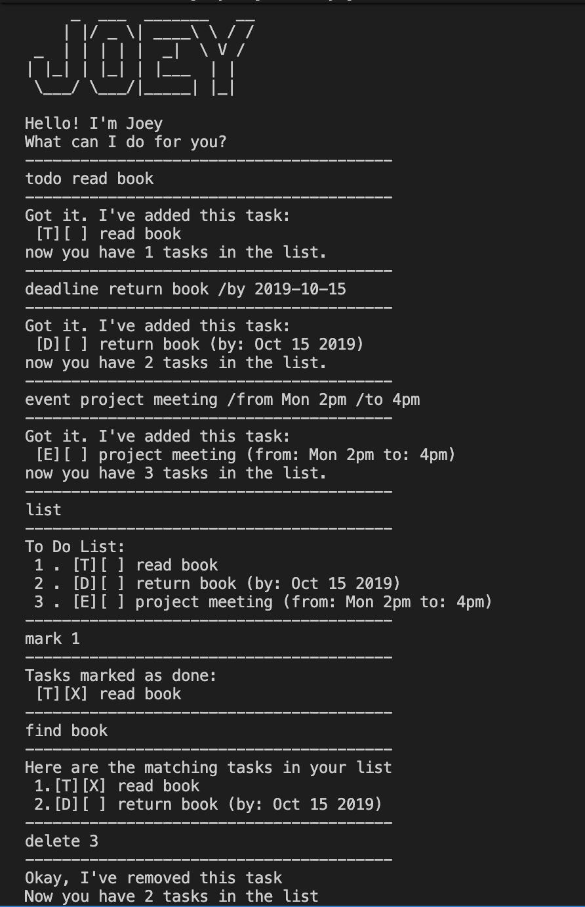

# Joey User Guide



**Joey** is a friendly, keyboard-driven task manager that lives in your
terminal. Track your todos, deadlines and events with short commands,
and Joey will save your list automatically so it's right there the next
time you launch him.

- Fast: everything is a single line of text.
- Persistent: your tasks are saved to `data/joey.txt` and reloaded on startup.
- Offline: no accounts, no network — just you and your list.

----

## Quick start

1. Make sure you have **Java 17 or later** installed.
2. Download the latest `joey.jar` from the
   [releases page](https://github.com/Xandurs/ip/releases).
3. Copy the JAR into an empty folder of your choice.
4. Open a terminal in that folder and run:
   ```
   java -jar joey.jar
   ```
5. Type your commands after the welcome banner appears. Type `bye` to exit.

> Joey stores your tasks in a `data/joey.txt` file next to wherever
> you ran the command from. Keep the JAR in the same folder each time
> and your list will follow you around.

----

## Features

### Viewing your list: `list`

Prints every task you currently have, in the order you added them.

Format: `list`

Expected output:

```
----------------------------------------
To Do List:
 1 . [T][ ] read book
 2 . [D][X] return book (by: Oct 15 2019)
 3 . [E][ ] project meeting (from: Mon 2pm to: 4pm)
----------------------------------------
```

The two brackets tell you at a glance:

- **Type** — `T` = todo, `D` = deadline, `E` = event.
- **Status** — `X` = done, blank = still to do.

----

### Adding a todo: `todo`

A todo is a task without a date attached to it.

Format: `todo DESCRIPTION`

Example: `todo read book`

Expected output:

```
----------------------------------------
Got it. I've added this task:
 [T][ ] read book
now you have 1 tasks in the list.
----------------------------------------
```

----

### Adding a deadline: `deadline`

A deadline has a due date. Dates must be written as `yyyy-mm-dd`.

Format: `deadline DESCRIPTION /by yyyy-mm-dd`

Example: `deadline return book /by 2019-10-15`

Expected output:

```
----------------------------------------
Got it. I've added this task:
 [D][ ] return book (by: Oct 15 2019)
now you have 2 tasks in the list.
----------------------------------------
```

> Joey shows the date back to you in a friendly `MMM dd yyyy` format,
> but you always type it in the standard `yyyy-mm-dd` form.

----

### Adding an event: `event`

An event has a start and end time. Both are free-form text — write
whatever makes sense to you.

Format: `event DESCRIPTION /from START /to END`

Example: `event project meeting /from Mon 2pm /to 4pm`

Expected output:

```
----------------------------------------
Got it. I've added this task:
 [E][ ] project meeting (from: Mon 2pm to: 4pm)
now you have 3 tasks in the list.
----------------------------------------
```

----

### Marking a task as done: `mark`

Marks the task at the given position as completed.

Format: `mark INDEX`

Example: `mark 2`

Expected output:

```
----------------------------------------
Tasks marked as done:
 [D][X] return book (by: Oct 15 2019)
----------------------------------------
```

Task numbers start at **1** and match what `list` shows.

----

### Marking a task as not done: `unmark`

Reverses `mark` — flips the status back to not done.

Format: `unmark INDEX`

Example: `unmark 2`

Expected output:

```
----------------------------------------
Tasks marked as undone:
 [D][ ] return book (by: Oct 15 2019)
----------------------------------------
```

----

### Deleting a task: `delete`

Removes the task at the given position from your list.

Format: `delete INDEX`

Example: `delete 1`

Expected output:

```
----------------------------------------
Okay, I've removed this task
Now you have 2 tasks in the list
----------------------------------------
```

---

### Finding tasks: `find`

Searches your list for tasks whose description contains the given
keyword (case-insensitive).

Format: `find KEYWORD`

Example: `find book`

Expected output:

```
----------------------------------------
Here are the matching tasks in your list
 1.[T][ ] read book
 2.[D][ ] return book (by: Oct 15 2019)
----------------------------------------
```

If nothing matches, Joey tells you `No matching tasks found.` instead.

----

### Exiting: `bye`

Saves your list and shuts Joey down.

Format: `bye`

Expected output:

```
----------------------------------------
Bye. Hope to see you again soon!
----------------------------------------
```

---

### Saving the data

Joey saves automatically after every add and delete — no `save`
command needed. The save file is `data/joey.txt`, created next to
wherever you launched Joey from. On the next launch, Joey reads that
file and restores your list.

If the file is missing or unreadable, Joey starts with an empty list
and skips any lines it can't understand.

----

## Command summary

| Action        | Format                                         | Example                                              |
| ------------- | ---------------------------------------------- | ---------------------------------------------------- |
| List tasks    | `list`                                         | `list`                                               |
| Add todo      | `todo DESCRIPTION`                             | `todo read book`                                     |
| Add deadline  | `deadline DESCRIPTION /by yyyy-mm-dd`          | `deadline return book /by 2019-10-15`                |
| Add event     | `event DESCRIPTION /from START /to END`        | `event project meeting /from Mon 2pm /to 4pm`        |
| Mark done     | `mark INDEX`                                   | `mark 2`                                             |
| Mark not done | `unmark INDEX`                                 | `unmark 2`                                           |
| Delete task   | `delete INDEX`                                 | `delete 1`                                           |
| Find tasks    | `find KEYWORD`                                 | `find book`                                          |
| Exit          | `bye`                                          | `bye`                                                |
